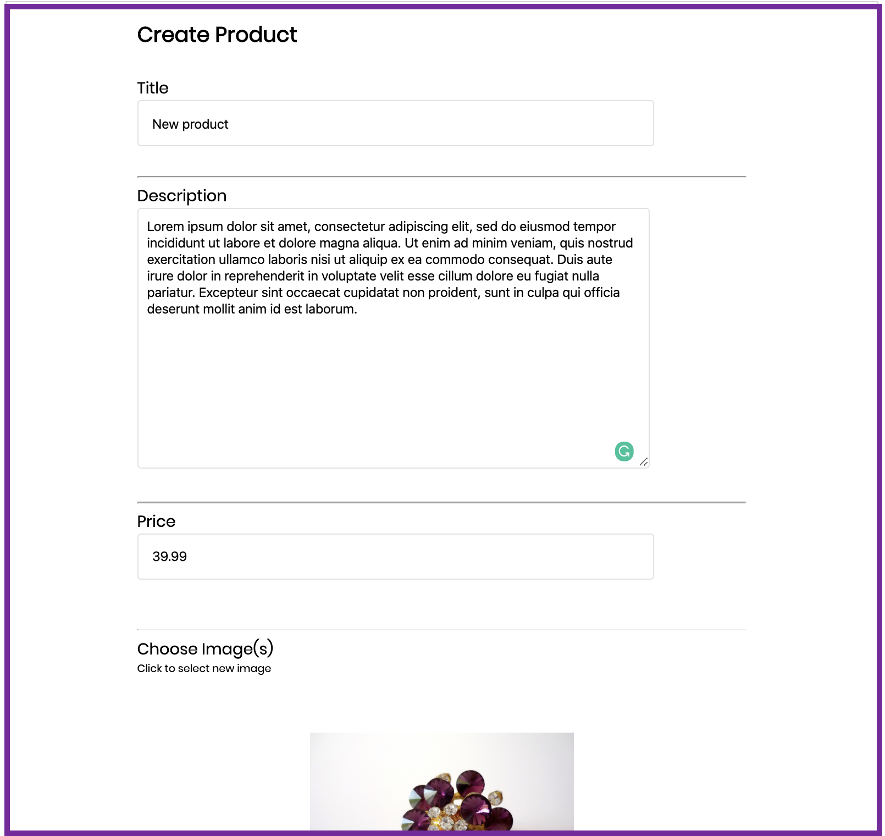

# Jewely

[Jewely live](https://jewely-fsp.herokuapp.com/#/)

## Background and Overview

Jewely is an Etsy inspired site that specializes in allowing users to buy and sell jewelry. It works like most e-commerce stores, except in this one, you could be a vendor. A user must sign up or sign in order to be able to sell.

## Technologies

### Tech Stack

- Database
  - PostgreSQL
- Backend
  - Ruby on Rails
- Frontend
  - React / Redux

### Noticeable Gems

- `bcrypt`
  - Hash passwords before they're stored in database
- `jbuilder`
  - Extract a JSON object from backend and pass it on to frontend
- `aws-sdk-s3`
  - Required for the use of AWS S3 in Rails applications
- `sass-rails`
  - Sass adapter for rails pipeline
    - All styling in this project was done through Sass
- `rubocop`
  - Connected to `husky` on frontend to lint Ruby code on commit

### Noticeable Dependencies

- `@babel/core`, `@babel/preset-env`, `@babel/preset-react`, `babel-loader`
  - Converts ES5+ JavaScript code into more compatible versions
- `react-responsive-carousel`
  - Displays images in a photo carousel
    - Used in product show pages and site landing page
- `webpack`, `webpack-cli`
  - Module bundler
- `react-router`
  - For frontned routing
- `husky`, `eslint`, and `prettier`
  - `husky` lints frontend code using `eslint` and `prettier` on commit

## Setup

In terminal:

1. `bundle install` to install Ruby gems
2. `npm install` to install JavaScript dependencies

In computer:

3. Make sure that PostgreSQL is running, if not, start it

In terminal:

4. `rails db:setup` to setup PostgreSQL database
5. `rails s` to start Rails server
6. `npm start` to start Webpack module bundler

In browser:

7. navigate to `http://localhost:3000` to view application

## Noticeable Features / How to use

#### Product CRUD (Create, Read, Update, Delete)

##### Create

1. After signing up / logging in, go to "Sell on Jewely" on top right of header
2. Create product listing and submit




```JavaScript
handleSubmit(e) {
    e.preventDefault();
    const formData = new FormData();

    formData.append('product[productId]', this.state.id);
    formData.append('product[title]', this.state.title);
    formData.append('product[description]', this.state.description);
    formData.append('product[price]', this.state.price);
    formData.append('product[seller_id]', this.state.seller_id);
    formData.append('product[errors]', this.state.errors);

    if (this.state.photoFiles) {
        const photos = this.state.photoFiles
        for (let i = 0; i < photos.length; i++) {
            formData.append('product[photos][]', photos[i]);
        }
    }

    this.props.action(formData)
        .then(() => this.props.history.push(`/`),
        (err) => { console.log(err) })
}
```

Both create **and** update actions share the same form (`frontend/components/products/create_update/product_form.jsx`). The only difference is that `#action` would be different depending on what got passed on from the container.

Code snippet above shows how data may be passed on to DB once a user clicks submits.

##### Read

1. Go to home page
2. Click on any product listing from index to view its show page


#### Update

[You must be signed in to do this]

1. Click on a product that you own
2. Click on "Edit your product listing" in product show page
3. Edit as needed and submit


#### Delete

1. After navigating to a product that you own, click on "Edit your product listing"
2. Click on "Delete product listing" (located at the bottom of product edit form)


```JavaScript
handleRemove() {
    // remove it from cart (if it is there)
    const cart = JSON.parse(localStorage.getItem('cart'))
    for (let i = 0; i < cart.length; i++) {
        if (parseInt(cart[i][0]) === this.state.id) {
            cart.splice(i, 1)
        }
    }
    localStorage.setItem('cart', JSON.stringify(cart))

    // remove it from database
    this.props.removeProduct(this.state.id)

    // change location to the main page
    location.hash = '#/'
}
```

As can be seen from snippet above, we first check if the cart has targeted item by checking `window.localStorage` (which is our next noticable feature). If it contains it, we remove it.

Then we trigger `removeProduct` to remove item from database. `this.state.id` would represent the id
of the product in the current show page.

Lastly, we navigate to the home page.

---

#### window.localStorage Cart

The cart of this site is mainly run on `window.localStorage`. It is constructed of an array of arrays, each sub-array consisting of two items, an id, and a quantity.

Example localStorage cart: `"[[43,2], [75, 1]]"` This cart would be considered to have two items with ids 43, 75 and quantities 2, 1 respectively.

Logically, when a user adds an item to their cart, then an array of id and the quantity (e.g. `[12, 2]`) of the item gets pushed to the parent array of localStorage cart. This is demonstrated in 'create' code snippet from 'CRUD' Noticeable Feature.

This was done mainly to allow guest users to add items to their cart without needing to sign in, allowing for better user experience in my belief. Moreover, another reasoning for this is to not query the cart database for each addition or deletion of a product, which could lead to somewhat slow performance.

---

## More Information

Checkout [dev README](./dev.README.md) for more details about the development process.
